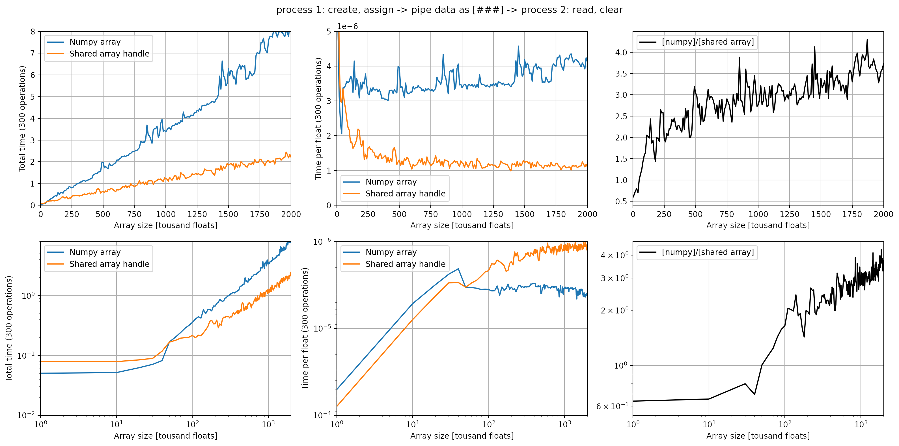

# multiprocessing_memory_share_benchmark
It is non-tivial to share data between different python processes.
Assuming you need to share an array from one process to another you have the following options:

1. multiprocessing.Array(...), suitable if the shared array can be created before the child process is spawned (shape is known).

2. Send numpy array over multiprocessing.Queue(...). This is only suitable if the sender no longer needs access to the array.

3. multiprocessing.shared_memory.SharedMemory(...). New in python 3.8+, allows shared memory objects to be created at runtime and shared using a handle. Covers the use case of 1. and 2.

4. mmap.mmap(..., mmap.MAP_SHARED), stores values on disk which can be read by all processes useful if array size is larger than available memory, but reading/writing to disk seems excessive otherwise

5. ???

Of these options, the introduction of multiprocessing.shared_memory in python 3.8 would be expected to render 2.(np.array->Queue) obsolete, as sending data over a queue requires tha data to be pickled. 
However, multiprocessing.shared_memory also has significant overhead. 

In the case where the same array is worked on concurrently by two processes that need simultaneous access to an array (communicating back and forth) multiprocessing.shared_memory is clearly the better choice.

However, the case where data only needs to be shared once, both option 2.(np.array->Queue) and 3. (multiprocessing.shared_memory) has significant overhead. 
The image below shows a comparison of the time per operation as a function of array size

On my system, sending a numpy array over a queue is faster for arrays of size <10000 floats
